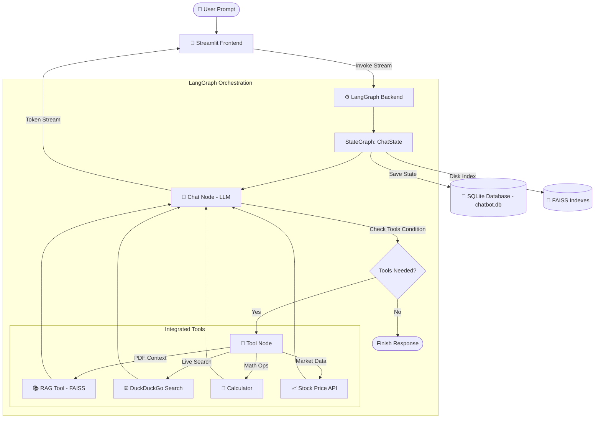

# 🤖 LangGraph Multi-Tool Chatbot with Per-Thread RAG & SQLite Memory

[](https://www.python.org/)
[](https://github.com/langchain-ai/langgraph)
[](https://github.com/langchain-ai/langchain)
[](https://streamlit.io/)
[](https://openai.com/)
[](https://github.com/facebookresearch/faiss)
[](https://www.sqlite.org/)

A full-stack, stateful Conversational AI assistant built using **LangGraph**, **LangChain**, **Streamlit**, and **SQLite**. This application features real-time message streaming, thread-isolated PDF RAG (Retrieval-Augmented Generation), integrated web search, financial stock price querying, a custom calculator, and persistent multi-thread session management.

---

## 🌟 Key Features

- **⚡ Real-Time Streaming UI**: Built with Streamlit (`st.write_stream`), delivering response tokens live as they are generated by the model.
- **🔧 Dynamic Tool Calling Indicators**: Interactive status indicators (`st.status`) highlight live tool execution (RAG retrieval, web search, stock lookup, calculation) and display completed tool invocations.
- **📚 Thread-Isolated PDF RAG**: Upload custom PDF documents for any chat thread. Text is chunked with `RecursiveCharacterTextSplitter`, embedded using OpenAI's `text-embedding-3-small`, and indexed in thread-isolated **FAISS** vector databases with local disk persistence.
- **🛠️ Multi-Tool Execution**:
  - **PDF RAG Retriever (`rag_tool`)**: Extracts context from the uploaded document specific to the active conversation thread.
  - **DuckDuckGo Search (`DuckDuckGoSearchRun`)**: Fetches real-time web news and search results.
  - **Financial Stock Tracker (`get_stock_price`)**: Retrieves real-time stock metrics via the Alpha Vantage API.
  - **Arithmetic Calculator (`calculator`)**: Executes precise basic math operations (`add`, `sub`, `mul`, `div`).
- **💾 SQLite Memory & Persistence**: Powered by LangGraph's `SqliteSaver` checkpointer (`chatbot.db`), persisting chat history and thread states across application restarts.
- **🗂️ Multi-Thread Chat Management**: Create new chats, switch between past conversations (automatically titled by the initial prompt), and delete threads directly from the sidebar.

---

## 🏗️ Architecture & Workflow

The architecture uses **LangGraph StateGraph** to manage conversational state, tool execution loops, and SQLite checkpointing.



---

## 📁 Repository Structure

```text
LANGGRAPH-CHATBOT/
├── faiss_indexes/         # Thread-isolated local FAISS vector stores
├── .env                   # Environment variables (API keys)
├── .gitignore             # Git ignore rule specifications
├── chatbot.db             # SQLite database file for LangGraph checkpoints
├── langgraph_backend.py   # LangGraph engine, tools, RAG, & SQLite saver
├── streamlit_frontend.py  # Streamlit UI, streaming generator, & sidebar logic
├── requirements.txt       # Python dependencies list
└── readme.md              # Project documentation
```

---

## 🚀 Getting Started

### 1. Prerequisites

- **Python 3.9+** installed on your system.
- An **OpenAI API Key** with access to `gpt-4o-mini` and `text-embedding-3-small`.

---

### 2. Installation

1. **Clone the Repository**
   ```bash
   git clone https://github.com/Jaydeep2020/LANGGRAPH-CHATBOT.git
   cd LANGGRAPH-CHATBOT
   ```

2. **Create and Activate a Virtual Environment**
   - **On macOS/Linux:**
     ```bash
     python3 -m venv .venv
     source .venv/bin/activate
     ```
   - **On Windows:**
     ```cmd
     python -m venv .venv
     .venv\Scripts\activate
     ```

3. **Install Dependencies**
   ```bash
   pip install -r requirements.txt
   ```

---

### 3. Environment Configuration

Create a `.env` file in the root directory:

```env
# OpenAI API Key (Required)
OPENAI_API_KEY=your_openai_api_key_here

# LangSmith Tracing (Optional)
LANGCHAIN_TRACING_V2=true
LANGCHAIN_API_KEY=your_langsmith_api_key_here
LANGCHAIN_PROJECT=langgraph-chatbot
```

---

## 💻 Running the Application

Launch the Streamlit dashboard:

```bash
streamlit run streamlit_frontend.py
```

The application will open automatically in your browser at `http://localhost:8501`.

---

## 📖 How to Use

1. **Start a New Chat**: Click **"New Chat"** in the sidebar to generate a new thread.
2. **Upload a PDF for RAG**:
   - Use the file uploader in the sidebar to attach a PDF to the current chat session.
   - Ask questions like: *"Summarize section 2 of the uploaded document"* or *"What does the document say about revenue?"*.
3. **Use Web Search**:
   - Ask real-time questions such as: *"What are the top tech headlines today?"*.
4. **Use Stock Price Lookup**:
   - Query stock quotes: *"What is the current stock price of TSLA?"*.
5. **Use Calculator**:
   - Ask math queries: *"Calculate 452 multiplied by 18"*.
6. **Switch & Manage Conversations**:
   - Click on any conversation title in the sidebar to reload its message history from SQLite.
   - Click the 🗑️ icon next to any thread to permanently remove its history.

---

## 🛠️ Tech Stack & Dependencies

| Category | Technology |
| :--- | :--- |
| **Framework & Graph** | [LangGraph](https://github.com/langchain-ai/langgraph), [LangChain](https://github.com/langchain-ai/langchain) |
| **LLM & Embeddings** | OpenAI `gpt-4o-mini`, `text-embedding-3-small` |
| **Frontend UI** | [Streamlit](https://streamlit.io/) |
| **Vector Store & RAG** | FAISS (`faiss-cpu`), `PyPDFLoader`, `RecursiveCharacterTextSplitter` |
| **State Persistence** | SQLite (`SqliteSaver`), `chatbot.db` |
| **External Tools** | DuckDuckGo Search API, Alpha Vantage Stock API |

---

## 📄 License

This project is open-source and available under the [MIT License](LICENSE).
